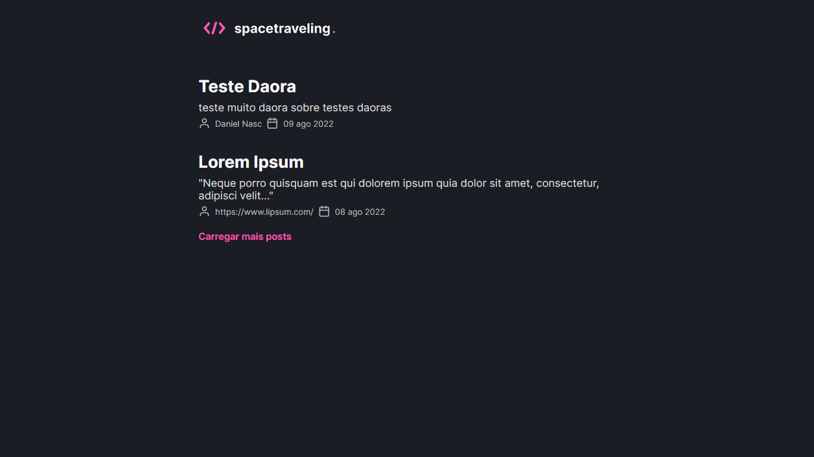
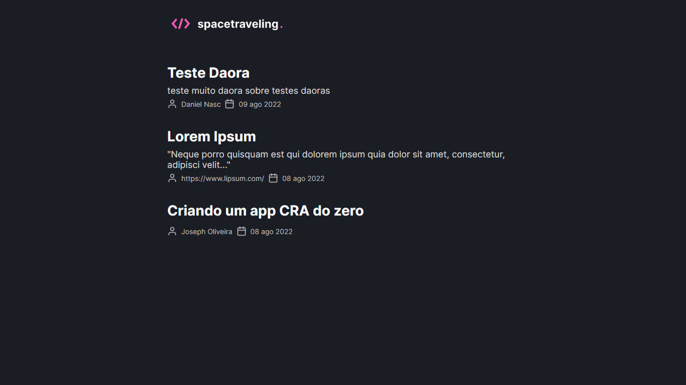
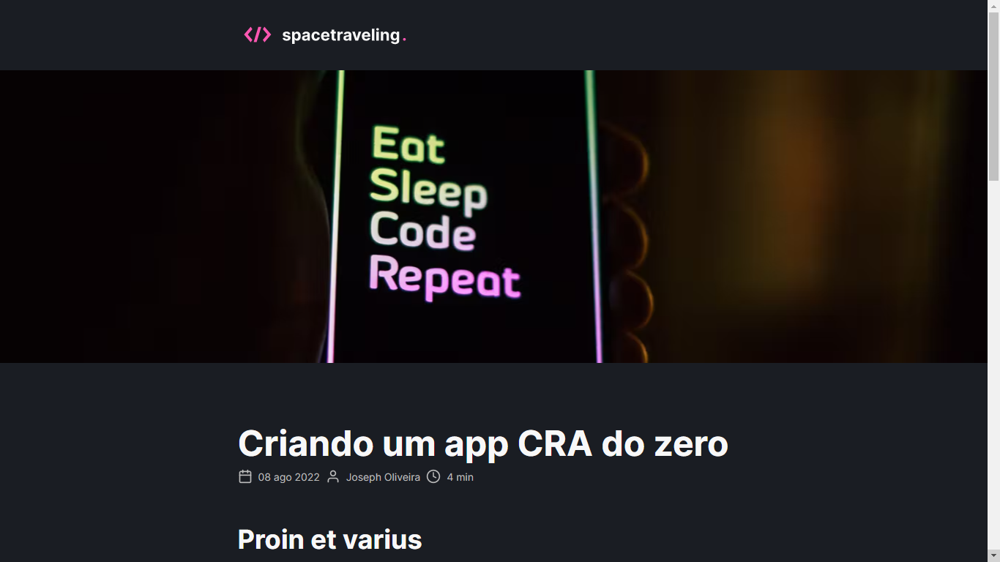
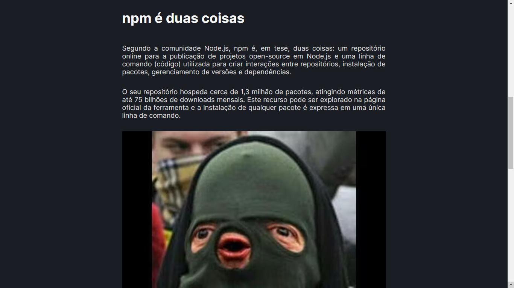
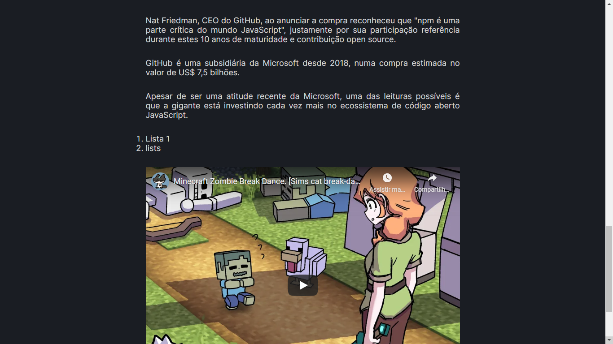

# Spacetraveling

Nesse desafio, você deverá criar uma aplicação para treinar o que aprendeu até agora no ReactJS

Essa será uma aplicação onde o seu principal objetivo é criar um blog do zero. Você vai receber uma aplicação praticamente em branco que deve consumir os dados do Prismic e ter a interface implementada conforme o layout do Figma. Você terá acesso a diversos arquivos para implementar:

- Estilizações global, comuns e individuais;
- Importação de fontes Google;
- Paginação de posts;
- Cálculo de tempo estimado de leitura do post;
- Geração de páginas estáticas com os métodos `getStaticProps` e `getStaticPaths`;
- Formatação de datas com `date-fns`;
- Uso de ícones com `react-icons`;
- Requisições HTTP com `fetch`;
- Entre outros.

## Principais recursos

- [NextJS](https://nextjs.org/)
- [ReactJS](https://reactjs.org/)
- [Pismic CMS](https://www.prismic.io/)
- [Figma](https://www.figma.com/)
- [date-fns](https://date-fns.org/)
- [react-icons](https://react-icons.netlify.com/)
- [fetch](https://developer.mozilla.org/en-US/docs/Web/API/Fetch_API)

## Prints

